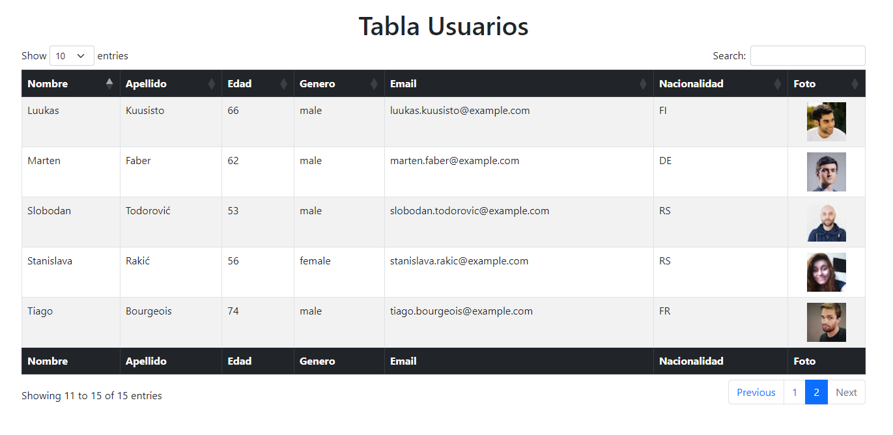

# Jarvis Users

The project consists of consuming an [API](https://randomuser.me/api/) and rendering a list of 15 users required by a telecommunications company considering data such as name, surname, age, gender, email, nationality and image.

## Built With

- HTML
- CSS
- JavaScript
- Bootstrap


## Run Locally

Click on Code


Copy the repository URL.


Open Git Bash and change the current working directory to the location where you want to clone the project.

```bash
  git clone https://github.com/allisonvp/Jarvis-users.git
```

Go to the project directory

```bash
  cd Jarvis-users/
```

Start a local server as Live Server with the project folder. You can change the BASE_URI variable in the config.js file.

```javascript
const BASE_URI = 'https://randomuser.me/api/';
```

## Demo

  
- List of users

  

 
